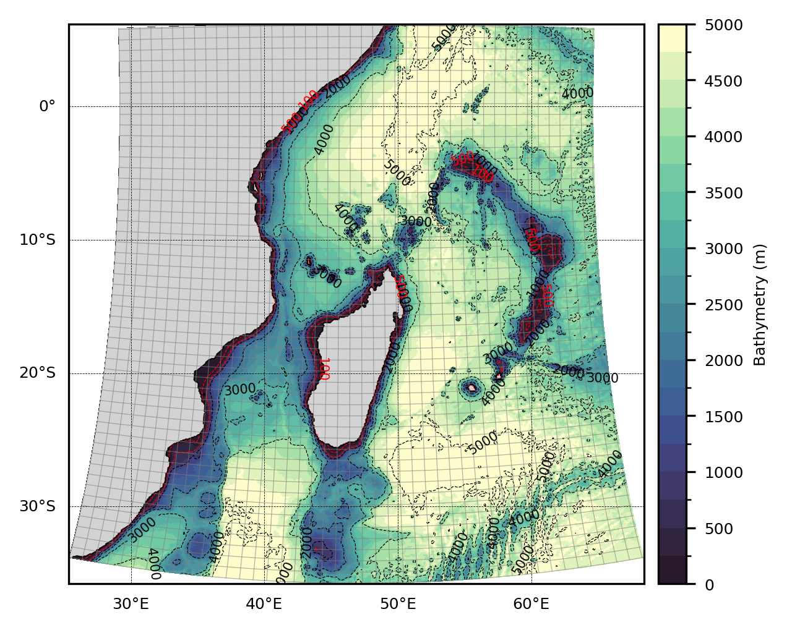

# Bibliography
Ce dossier contiendra les articles/livres/conferences utilisés comme sources pour ma bibliographie.

*Figure 1: Étendue de la zone étudiée.*

## [Progress in understanding of Indian Ocean circulation, variability, air-sea exchange, and impacts on biogeochemistry.](os-17-1677-2021.pdf)
Une review décrivant le contexte physique des processus océaniques de l'Océan Indien. À partir de cette review, il serait intéressant de dégager les processus affectant la circulation dans la partie Sud-Ouest de l'océan Indien et les questions scientifiques qui en découlent.

## [Multidecadal and climatological surface current simulations for the southwestern Indian Ocean at 1/50° resolution.](gmd-16-1163-2023.pdf)
Une description d'une configuration régionale du modèle d'océan CROCO sur le Sud-Ouest de l'océan Indien, construite de manière analogue à celle que je vais utiliser, associée à une analyse climatologique des sorties de modèle.

## [A generic approach to explicit simulation of uncertainty in the NEMO ocean model.](Brankart%20et%20al.%20-%202015%20-%20A%20generic%20approach%20to%20explicit%20simulation%20of%20uncer.pdf)
Une description de la méthode probabiliste et ensembliste sur laquelle se base la méthodologie de mon stage. Nous souhaitons appliquer cette méthode à notre modèle régional afin de quantifier les incertitudes associées à la circulation de surface du Sud-Ouest de l'Océan Indien.

## [Simulation climatologique décennale de la circulation océanique en mer du Labrador à l’aide du modèle CROCO](BELLAYER_rapportOPB205.pdf)
Un rapport de stage utilisant CROCO, fournissant des bases pour la présentation de modèles numériques.