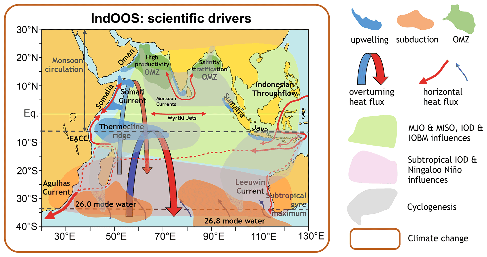

# Semaine du Lundi 10 Fevrier

## Lundi
Adastra est en panne aujourd'hui donc je fais de la lecture. J'ai lu et annoté [l'article sur l'analyse climatologique](../bibliography/gmd-16-1163-2023.pdf) et je vais commencer [celui sur le contexte physique](../bibliography/os-17-1677-2021.pdf)

## Mardi
 ~~Adastra est toujours en panne ce matin donc~~ je continue de travailler sur le contexte dynamique de la région. 

- **Connexion entre l'océan Pacifique et l'océan Indien:** Le flot indonésien traversant (*Indonesian ThroughFlow* ITF) injecte de l'eau douce et chaude dans l’océan Indien tropical du sud. Ces eaux sont beaucoup plus légères que celles plus au Sud, ce qui crée un gradient Nord-Sud de densité, et donc de pression, qui va alimenter différents courants.
  - *Le courant géostrophique de surface*, large et dirigé vers l’est entre 16 et 32° S et entre Madagascar et l'Australie.
  - *Le courant de Leeuwin*, dirigé vers l'Antarctique et longeant l'Australie.
- **Courant d'Agulhas:** Ce courant de surface et d'eau moyennement profonde, qui longe la pointe de l'Afrique, déplace de la chaleur rapidement vers le sud. Ce courant contribue pour 30% de l'exportation de chaleur (*heat*) de l'océan Indien.
- **Le courant de Leeuwin:** Ce courant contribue moins à l'export de chaleur que le courant d'Agulhas, mais il permet l'injection d'une grande variété de tourbillon méso-echelle transport de la chaleur et de la quantité de mouvement (*momentum*).
- **Les cellules:** Ces cellules, au nombre de deux, permettent de connecter différentes zones de remontées d'eau dans le Sud et le Nord de l'océan Indien. Elles jouent un rôle majeur dans la régulation de l'équilibre moyen, tropical et interannuel, de chaleur dans l'océan Indien.
  - *La cellule sub-tropicale* emmène de l'eau froide jusqu'au nord de l'océan Indien
  - *La cellule cross-equatoriale* ramène l'eau froide du pôle jusqu'au milieu de l'océan Indien.
- **Les eaux modales[^1]:** 
  - *À des profondeurs intermédiaires (500-2000 m)*, les eaux modales venant de l'océan Austral entrent dans l'océan Indien. Lors de le chemin d'ascension, elles vont se mélanger avec les eaux de surface plus légères et entamer un mouvement de remontée vers la surface dans différentes régions au nord the 10° S puis vont être ramenées vers le Sud dans un transport d'Ekman[^2] d'ensemble des eaux de surface
  - *En profondeur (2000-4000 m)*, les eaux modales se mélangent avec les eaux plus denses en profondeur et rejoignent le courant d'eau profonde allant vers le Sud. Ce courant a une contribution des eaux profondes d'Antarctique qui se déplacent vers le Nord.
- **L'écoulement cross-équatorial:** Cet écoulement est accompli aux profondeurs abyssales ainsi qu'avec le Courant de Côte d'Afrique de l'Est (EACC), le Courant Somalien inversant saisonnièrement ainsi que par le transport d'Ekman vers le Sud.
- **El Niño:** Il s'agit d'une anomalie positive et pseudo-périodique (2 à 7 ans) des températures de l'océan Pacifique qui entraine un vent anicyclonique dans l'océan Indien du Sud-Est.
  - *El Niño Southern Oscillation (ENSO)*, relie le phénomène El Niño et l'oscillation australe de la pression atmosphérique. Elle alimente les variations de SSS (*Sea Surface Salinity*) et permet, par la propagation vers l'Est d'onde de Rossby, de maintenir le réchauffement de l'océan Indien tropical.
- **La Niña:** Il s'agit là d'une anomalie négative également pseudo-périodique, mais non corrélée à El Niño, des températures de l'océan Pacifique qui va entrainer un vent cyclonique.
  - De la même manière que pour El Niño, ENSO va prolonger les anomalies de température au sein de l'océan Indien.

[^1]: Masses d’eau homogènes formées par le mélange et la convection dans certaines régions des océans, souvent associées à des gyres subtropicaux.
[^2]: Mouvement des eaux de surface dû à l'action des contraintes des vents et de la force de Coriolis.

*Figure 1: Vue schématique des phénomènes clés dans l'Océan Indien. https://doi.org/10.5194/os-17-1677-2021*

J'ai commencé à plot différentes cartes, pour le moment carte de vent et cartes de bathymétrie. Demain je vais essayer de faire une carte d'EKE et travailler sur les zones de Lisa qui sont dans [ce script](../scripts/lweiss_mod/KE/eke_avg_croco.py).