# MLD

In this folder are all the scripts related to the mixing layer depth. We found computing scripts as well as plotting, etc.

## Scripts
- [save_mld.py](./save_mld.py): This script computes the Mixing Layer Depth (MLD) using a simple masking method.
- [save_mld_interp.py](./save_mld_interp.py): This script is the improved version for computing the MLD. It takes into account the local density variation and use a linear interpolation to get rid of the vertical levels limitation.
- [comp_mld.py](./comp_mld.py): This script plots slices of the MLD. It also plots the bathymetry for this slice.
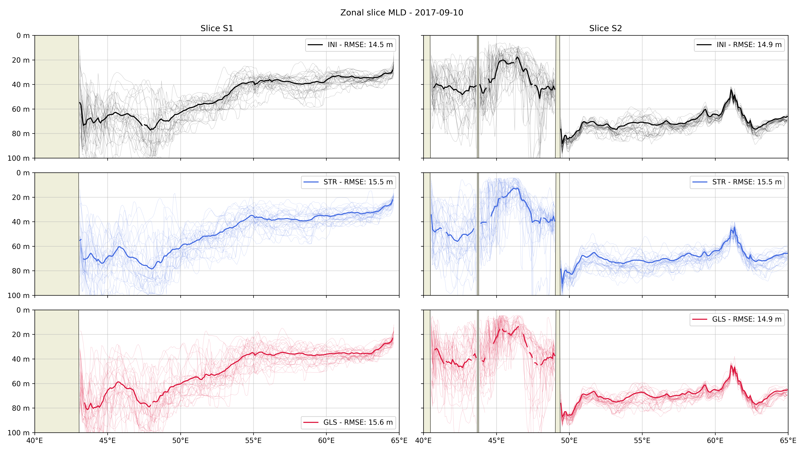
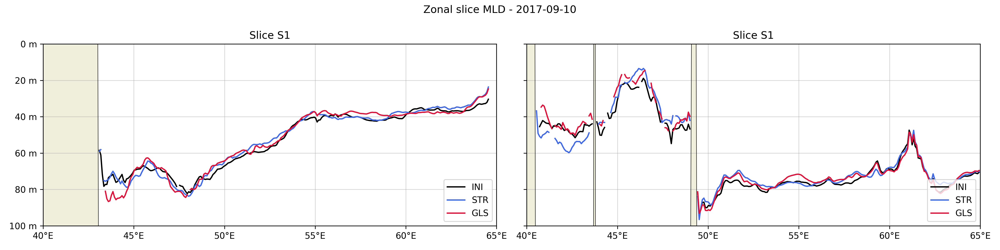
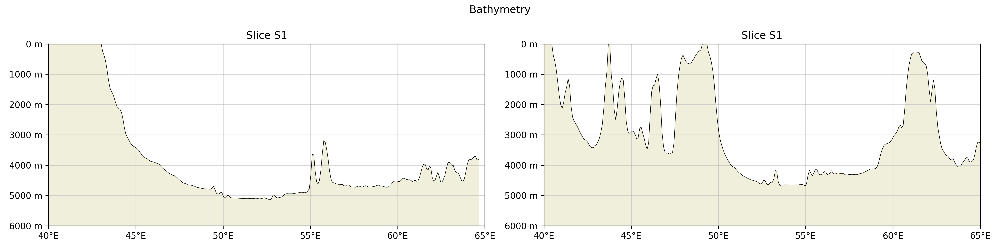
- [comp_mld_slice.py](./comp_mld_slice.py): This script plots maps of the ensemble mean and standard deviation of the MLD for the three ensembles.
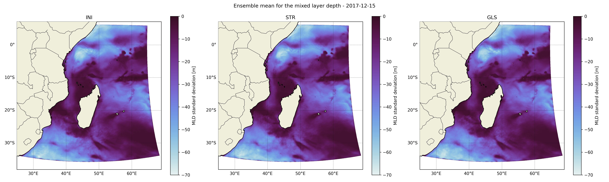
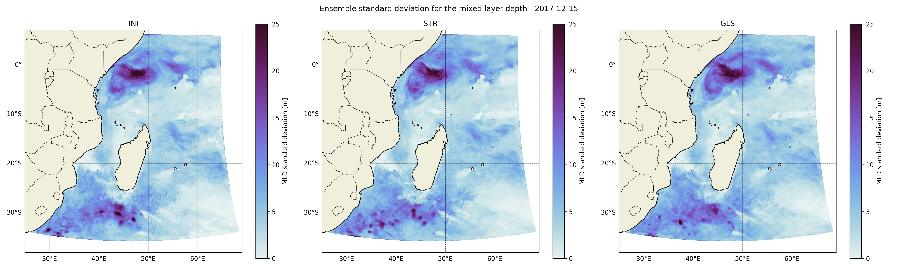
- [compute_mld.py](./compute_mld.py): This script plots a map and slices of the MLD. It also plots the mask used to compute the MLD.
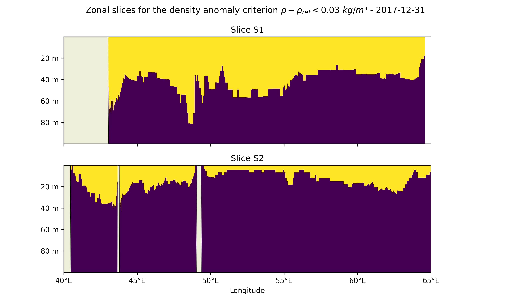
- [density_slice.py](./density_slice.py): This script plots a slice of the density.
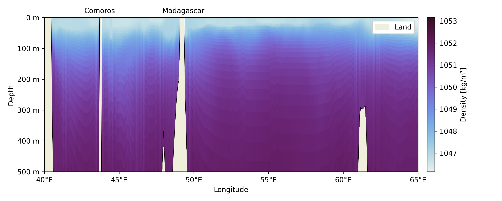
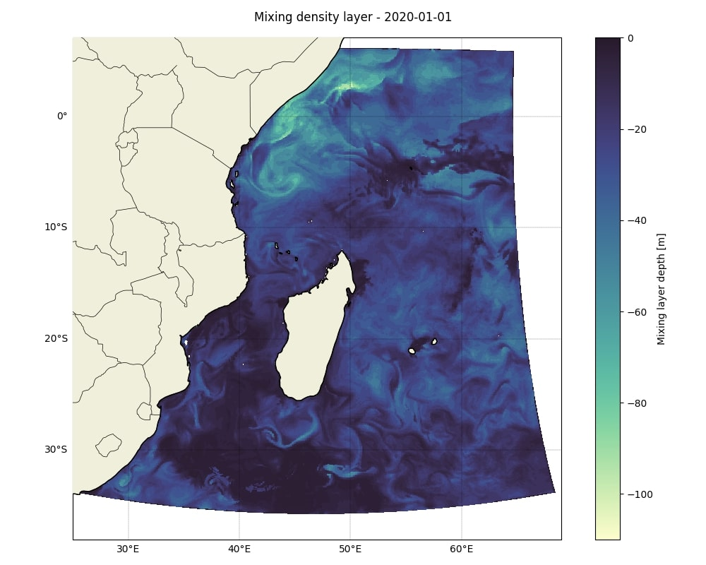
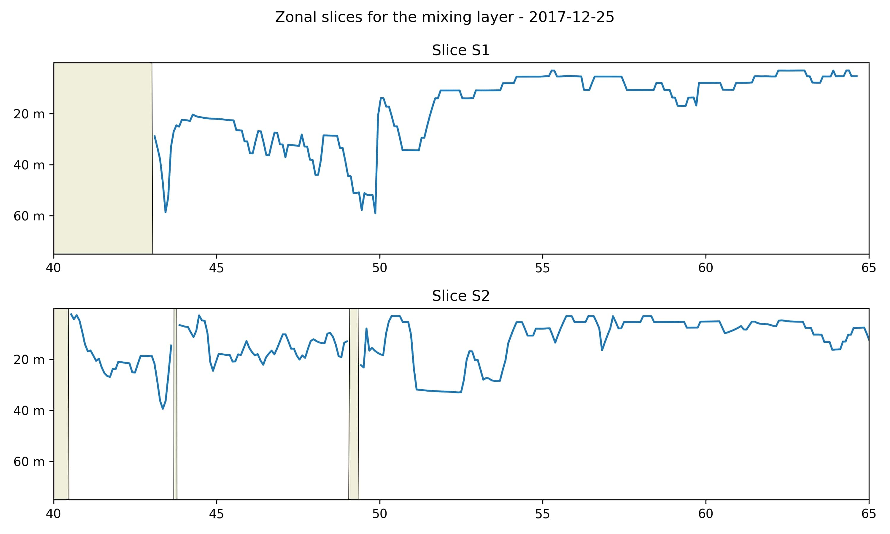
- [mld_dispersion.py](./mld_dispersion.py): This script plots a time series of the dispersion of the MLD.
- [mld_hist_from_files.py](./mld_hist_from_files.py): This script plots the histograms of the MLD of the sub-regions.
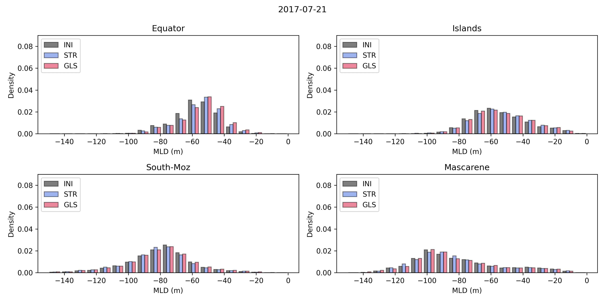
- [plot_mld.py](./plot_mld.py): This script plots a map of the interpolated MLD.
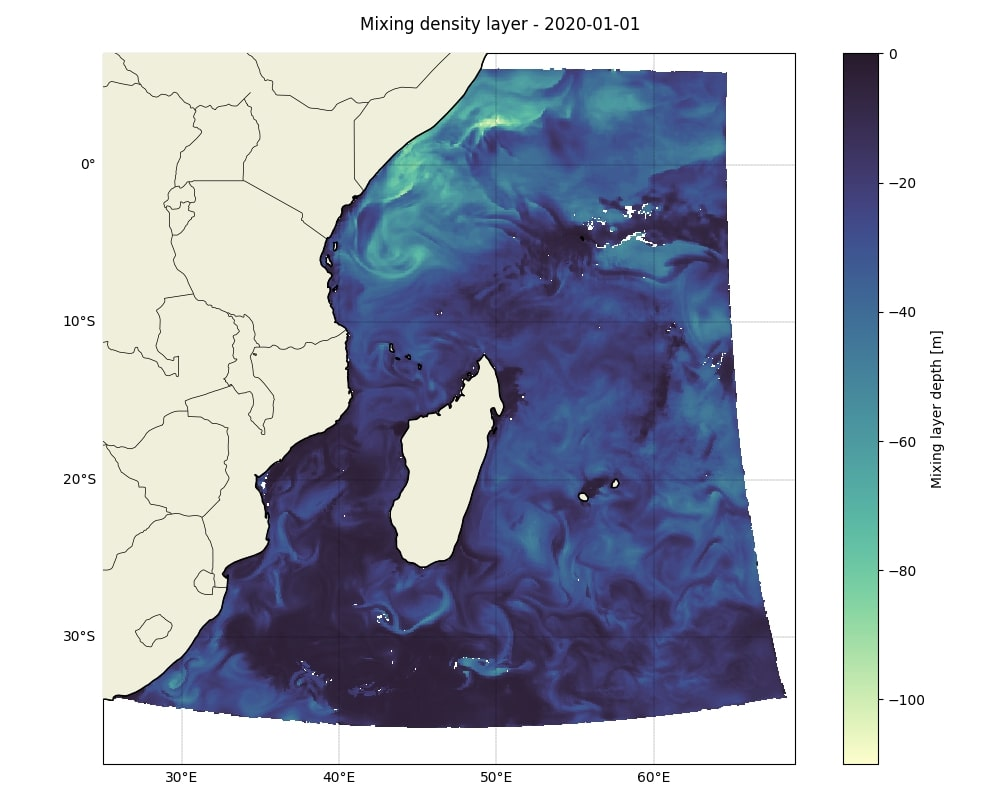
- [plot_mld_from_files.py](./plot_mld_from_files.py): This script plots the MLD from the files in which it is saved.
- [plot_mld_points.py](./plot_mld_points.py): This script plots a superposition of the mean MLD for each ensemble in a given point.
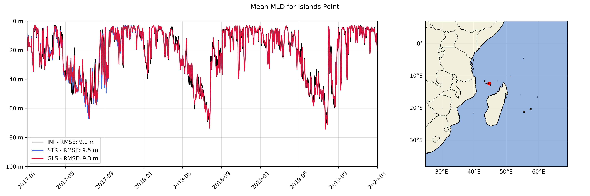
- [plot_mld_slices_from_files.py](./plot_mld_slices_from_files.py): This script plots a comparison between slices and ensemble of the MLD from the files in which they are saved.

- [plot_time_series_from_files.py](./plot_time_series_from_files.py): This script plots the time series of the MLD from the files in which they are saved.

