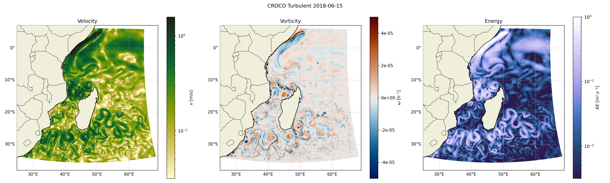
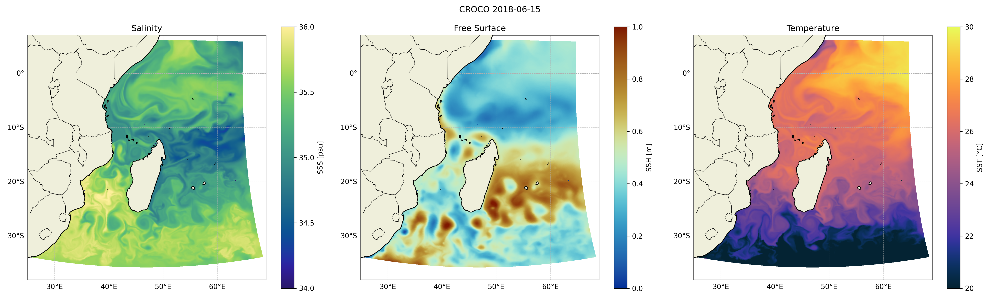
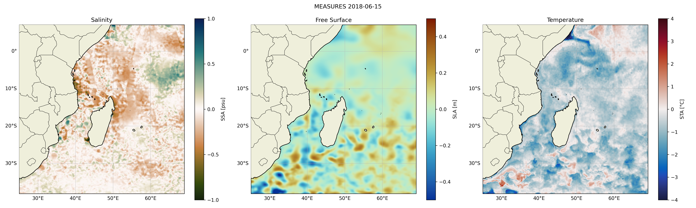

# basic 
In this folder, we found script for plotting annual mean, instantaneous and anomalies for each of the following (physical) fields : Salinity, Free Surface and Temperature.

## Scripts
- [dynamical_croco.py](./dynamical_croco.py): This script plot the dynamical maps from the simulation. There is instantaneous, turbulent and mean velocity, vorticity and energy.

- [physical_croco.py](./physical_croco.py): This script plot the physical maps from the simulation. There is instantaneous, mean and anomalies for the salinity, temperature and free surface.

- [physical_measures.py](./physical_measures.py): This script plot the physical maps from the observation. There is instantaneous, mean and anomalies for the salinity, temperature and free surface.
