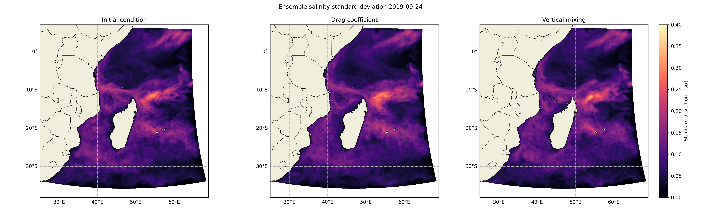
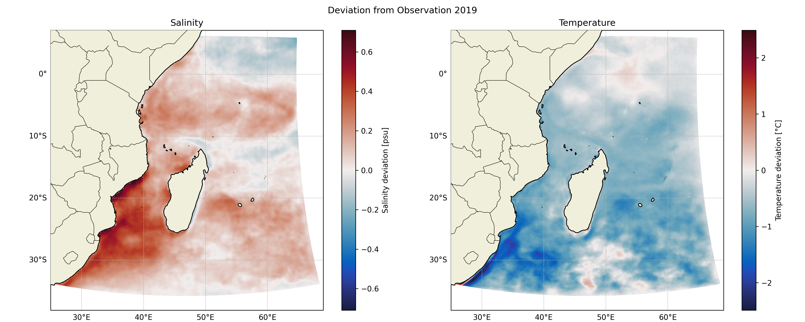

# comparison

In this folder are the scripts used to compare simulations. We can plot dispersion and surface field comparison.

## Scripts
- [dispersion.py](./dispersion.py): This script opens the std `.nc` files for all ensemble about any variables chosen and plot a map of the ensemble spread for each ensemble.

- [surface_fields.py](./surface_fields.py):  This script opens an average file from any given simulation and plot a map of the annual bias between the simulation and the observation.

  

