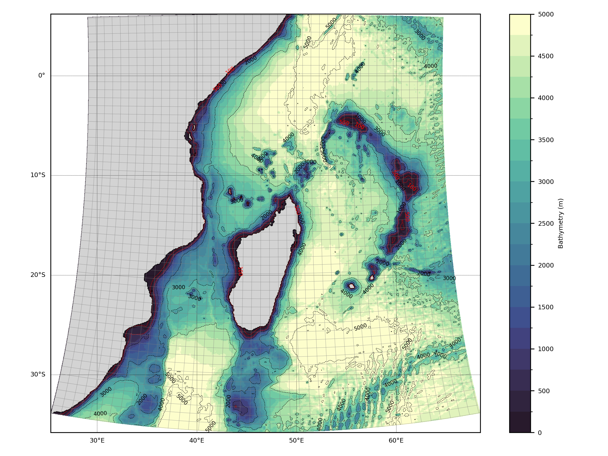
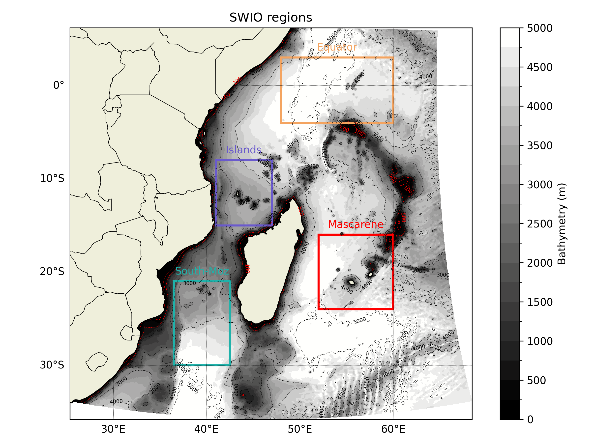
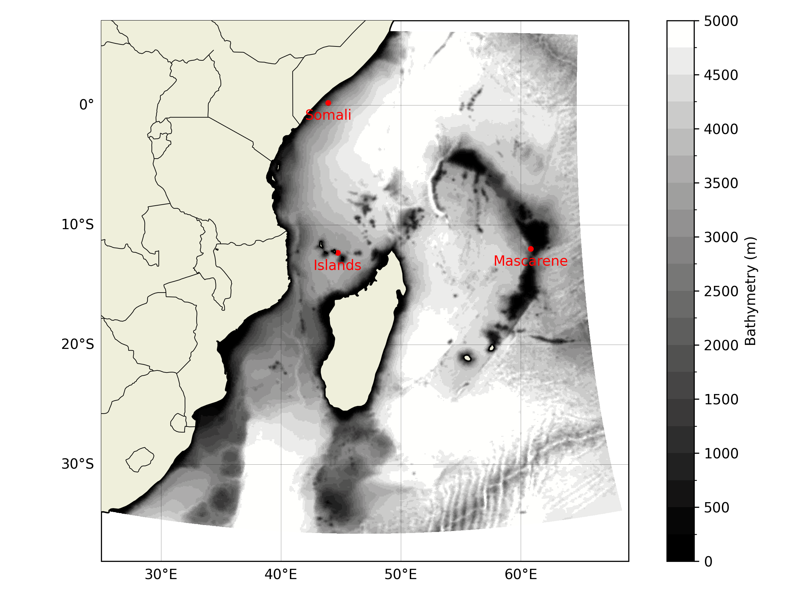
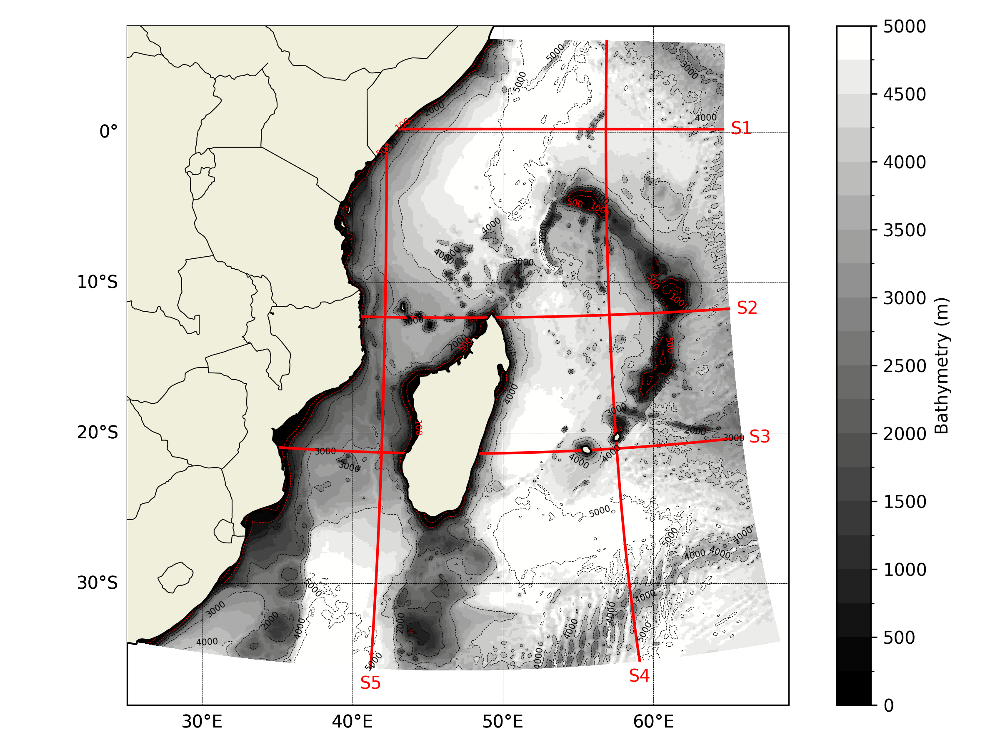
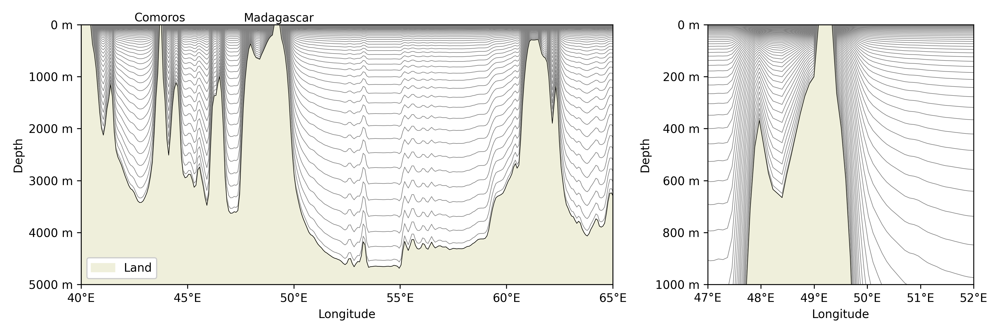

# grid

This folder contains scripts related to the grid.

## Scripts

- [bathy.py](./bathy.py): This script plot the bathymetry of the SWIO.

- [bathy_box.py](./bathy_box.py): This script plot the bathymetry of the SWIO with the sub-regions.

- [bathy_points.py](./bathy_points.py): This script plot the bathymetry of the SWIO with the points.

- [bathy_slices.py](./bathy_slices.py): This script plot the bathymetry of the SWIO with the slices.

- [bathy_vertical.py](./bathy_vertical.py): This script plot a slice to display the vertical levels.

- [compute_depth.py](./compute_depth.py): This script create a new `.nc` file containing the 3D grid.
- [regrid.py](./regrid.py): This script allows for the regridding of the observation data to the same grid as the simulation.