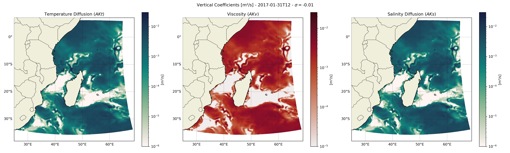
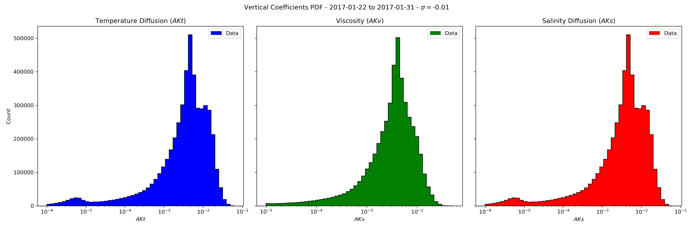
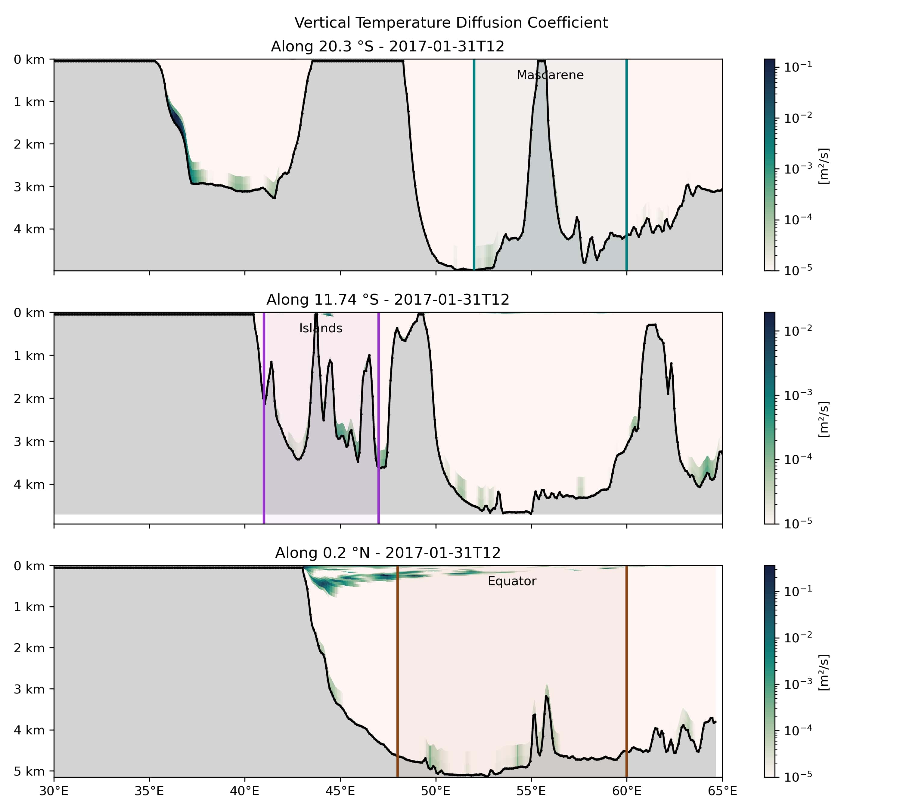

# mixing

In this folder are the scripts used for the prep of the vertical mixing simulation (map of various variables related, slices, PDF, ...).

## Scripts
- [map.py](./map.py): This script plots a map of the different vertical viscosity and vertical diffusivity (temperature and salinity) coefficients.

- [pdf.py](./pdf.py): This script plots the PDF of the same coefficients.

- [slice.py](./slice.py): This script plots a slice of the vertical temperature diffusion coefficient along different slices.

