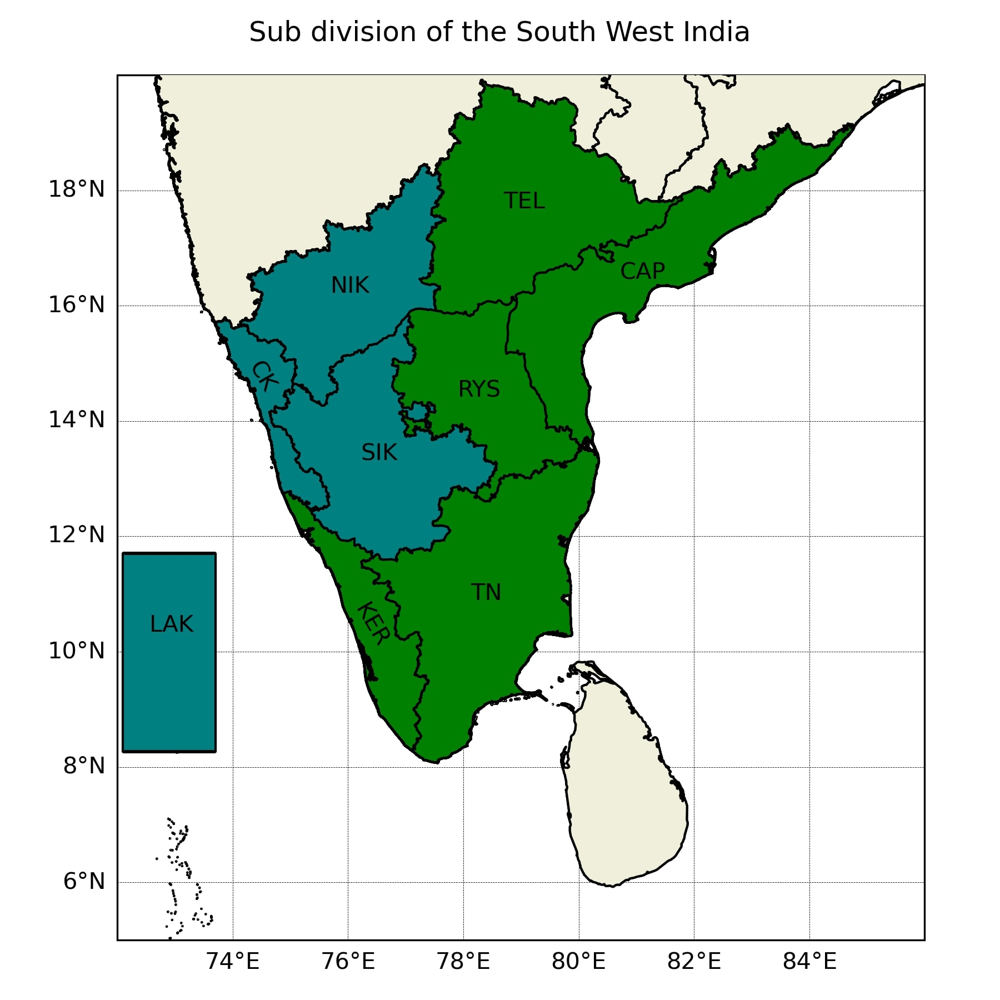
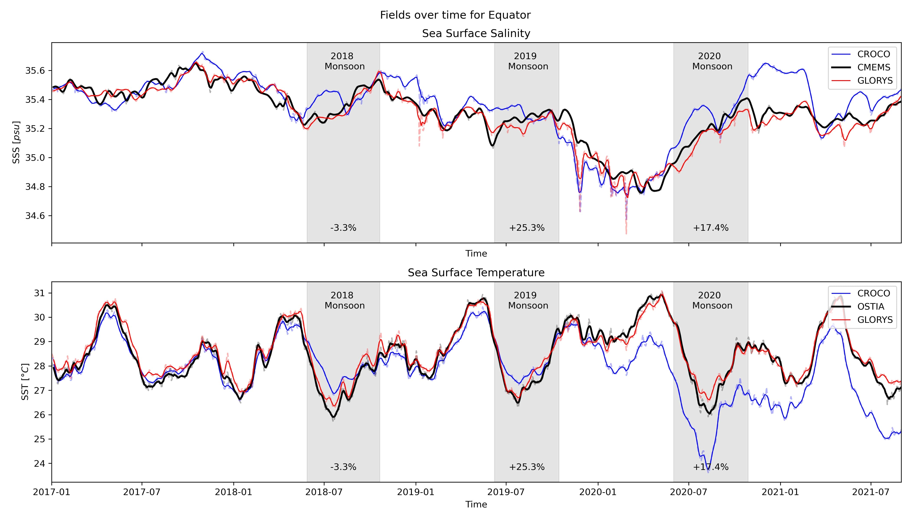

# monsoon

In this folder are two scripts used to study the impact of monsoon on the equator zone. Work not followed. 

## Scripts
- [india_subdiv.py](./india_subdiv.py): This script plots the India with the subdivision used in by the Indian Meteorology department

- [time_series.py](./time_series.py): This script plot a time series of the temperature and salinity with an overlay of the monsoon during that period.
