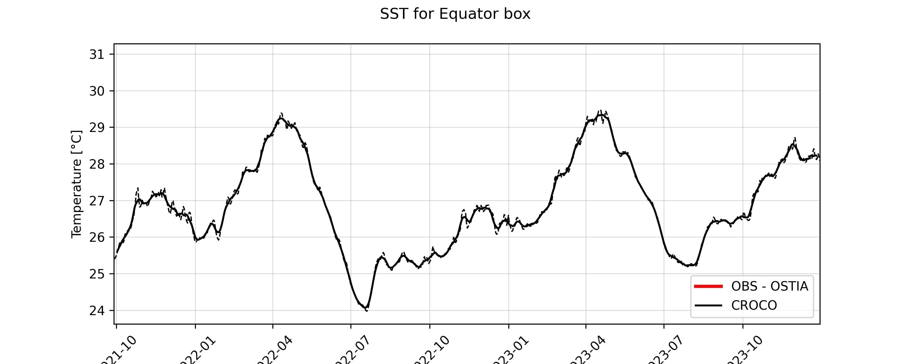
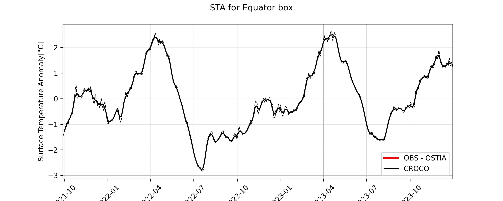
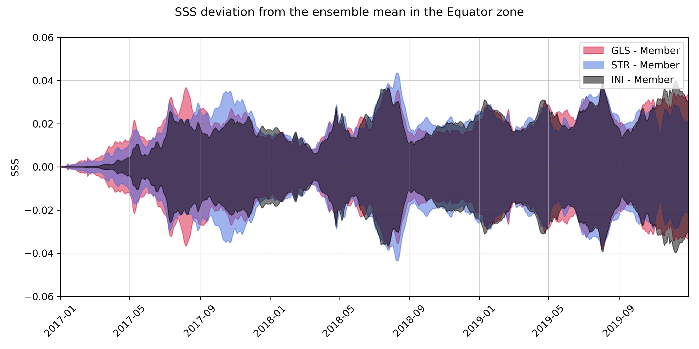

# time_series

In this folder are the scripts used to compute and plot time series.

## Scripts
- [1box_1plot.py](./1box_1plot.py): This script computes and plots the time series for the tracers values and anomalies in each sub-region.

- [plot_time_series_from_files.py](./plot_time_series_from_files.py): This script plots the deviation for each sub-region.
